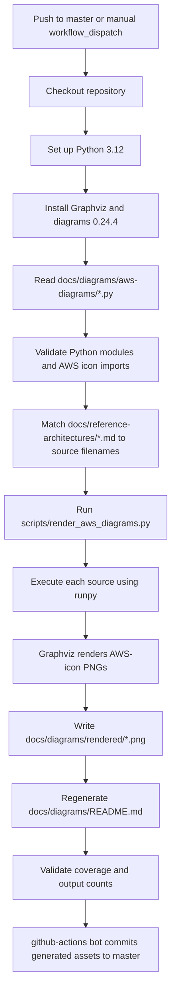

# AWS Enterprise Architecture Handbook

A portfolio-ready AWS architecture repository covering Solutions Architect Professional, Developer, Security Specialty, Advanced Networking, Amazon Bedrock, agentic AI, security data engineering, SOC patterns, observability, and secure cloud operations.

> **Canonical content root:** all learning content, reference architectures, runbooks, diagrams, and notebooks live under this `AWS-Enterprise-Architecture-Handbook/` directory. Repository-level `.github/` remains at the GitHub-required location for automation.

## Start Here

1. [Architecture Documentation Index](docs/INDEX.md)
2. [Rendered AWS Architecture Diagram Gallery](docs/diagrams/README.md)
3. [Repository Index](INDEX.md)
4. [Learning Path](LEARNING_PATH.md)
5. [Architecture Template](templates/ARCHITECTURE_TEMPLATE.md)
6. [Diagram Standards](standards/DIAGRAM_STANDARDS.md)
7. [Public Repository Safety](standards/PUBLIC_REPOSITORY_SAFETY.md)

## Architecture Diagrams

The active diagram pipeline uses:

- **Python architecture-as-code** under `docs/diagrams/aws-diagrams/`
- **AWS service icons** supplied by the Python `diagrams` package
- **Graphviz** for layout and image generation
- **Rendered PNG previews** under `docs/diagrams/rendered/`
- **A generated gallery** at `docs/diagrams/README.md`

The legacy PlantUML files under `docs/diagrams/aws-icon/` are retained only as historical editable sources where still useful. The GitHub Actions production renderer does not depend on them.

Every Markdown article in `docs/reference-architectures/` must have a same-name Python source file. The build fails when a reference architecture lacks a diagram source or when a Python source does not produce a PNG.

## How GitHub Actions Creates and Publishes the Diagrams

### Workflow Assets and Commands

| Stage | Source or command | Purpose |
|---|---|---|
| Workflow | `.github/workflows/render-aws-diagrams.yml` | Defines triggers, dependencies, validation, rendering, and publication |
| Architecture narratives | `docs/reference-architectures/*.md` | Defines the architecture cases that require diagrams |
| Diagram sources | `docs/diagrams/aws-diagrams/*.py` | Editable AWS architecture-as-code definitions |
| Import gate | Python AST plus `importlib` | Verifies every imported icon exists before rendering |
| Render command | `python AWS-Enterprise-Architecture-Handbook/scripts/render_aws_diagrams.py` | Runs all diagram definitions and rebuilds the gallery |
| Rendered output | `docs/diagrams/rendered/*.png` | GitHub-viewable professional AWS diagrams |
| Gallery output | `docs/diagrams/README.md` | Generated visual index and cross-links |
| Publication | `git add`, `git commit`, `git push` | Commits generated assets through `github-actions[bot]` |

## What Is Included

- certification-specific learning tracks
- AWS-icon annotated architecture narratives
- step-by-step configuration and validation runbooks
- case studies and business objectives
- rendered PNG architecture diagrams
- editable Python architecture-as-code sources
- Jupyter notebooks
- security/privacy control guidance
- Well-Architected decision checklists
- AI-agent and MCP patterns
- honeypot and threat-detection designs

## Major Tracks

- `01-solutions-architect-professional`
- `02-developer`
- `03-security-specialty`
- `04-advanced-networking`
- `05-bedrock-agentic-ai`
- `06-data-engineering-security-analytics`
- `07-soc-architectures`
- `08-reference-architectures`
- `docs/reference-architectures`
- `docs/runbooks`
- `docs/diagrams`
- `runbooks`
- `notebooks`

## Safety

All examples are synthetic. Do not commit credentials, account IDs, private IPs, internal DNS names, customer data, CUI, PII, or production topology.
