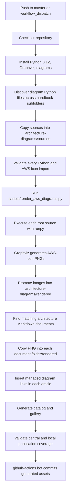
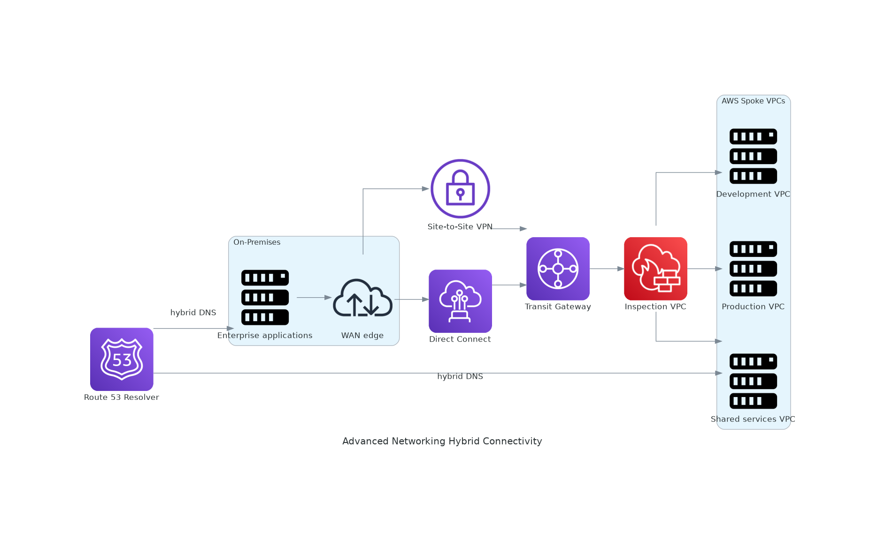
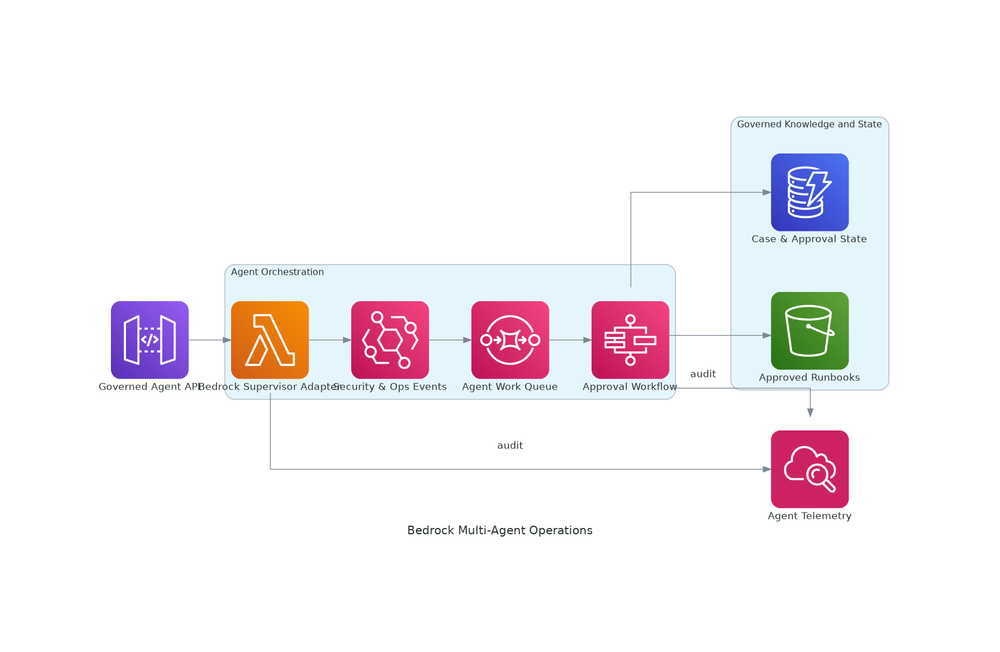
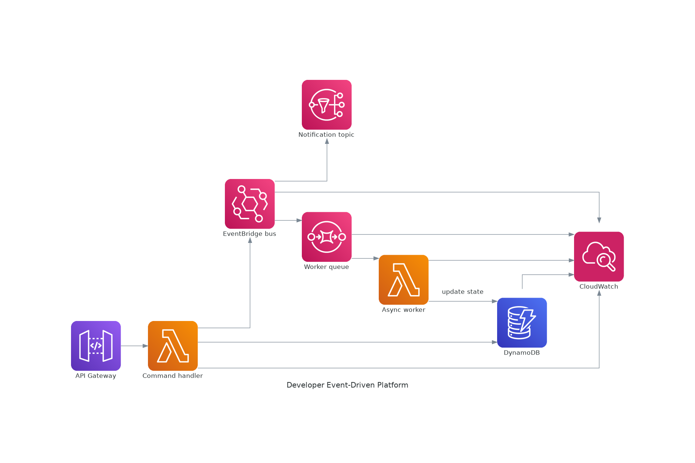
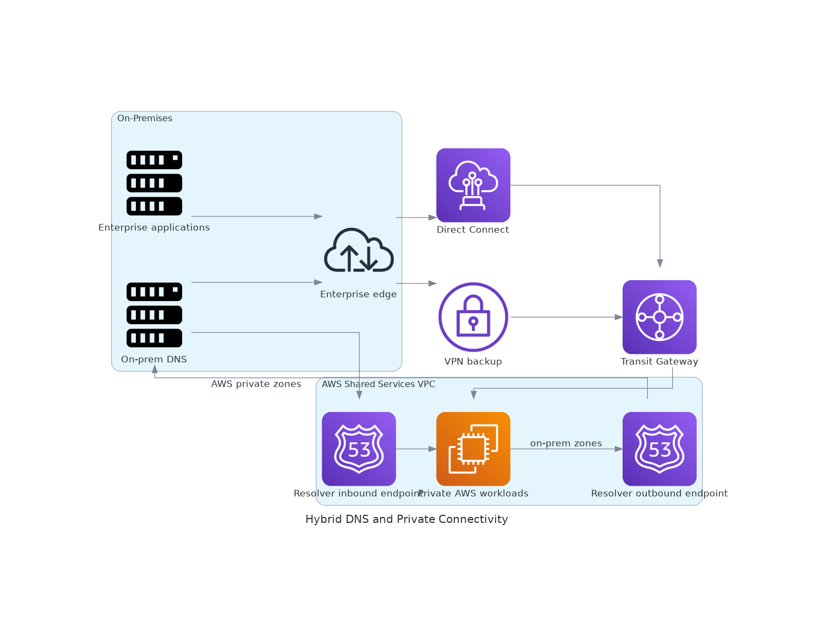
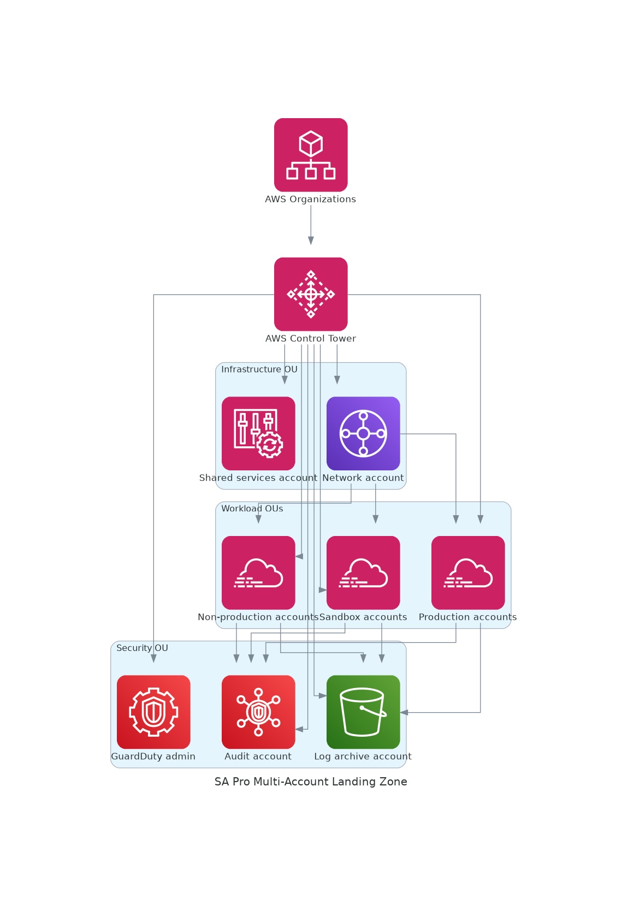
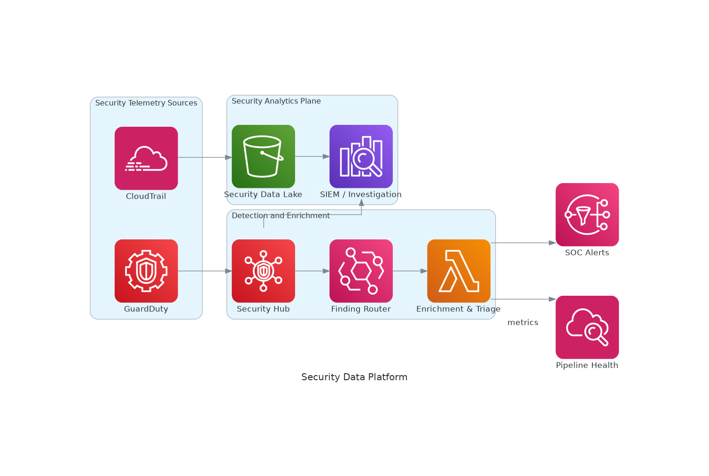
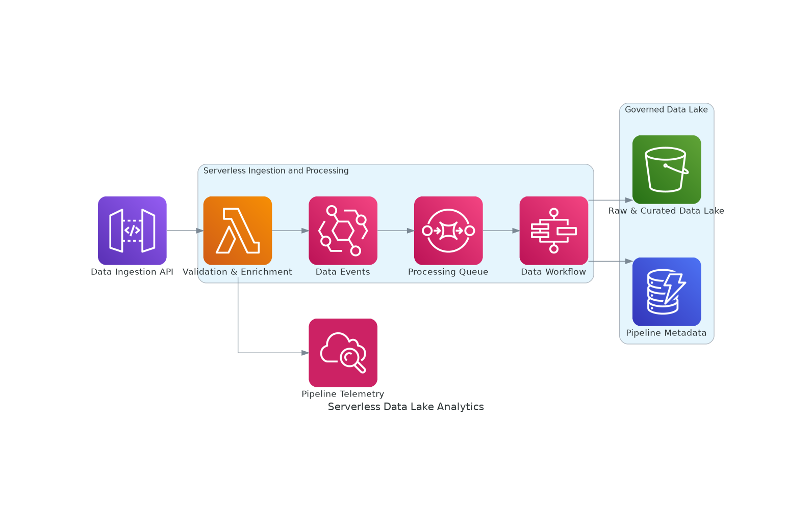
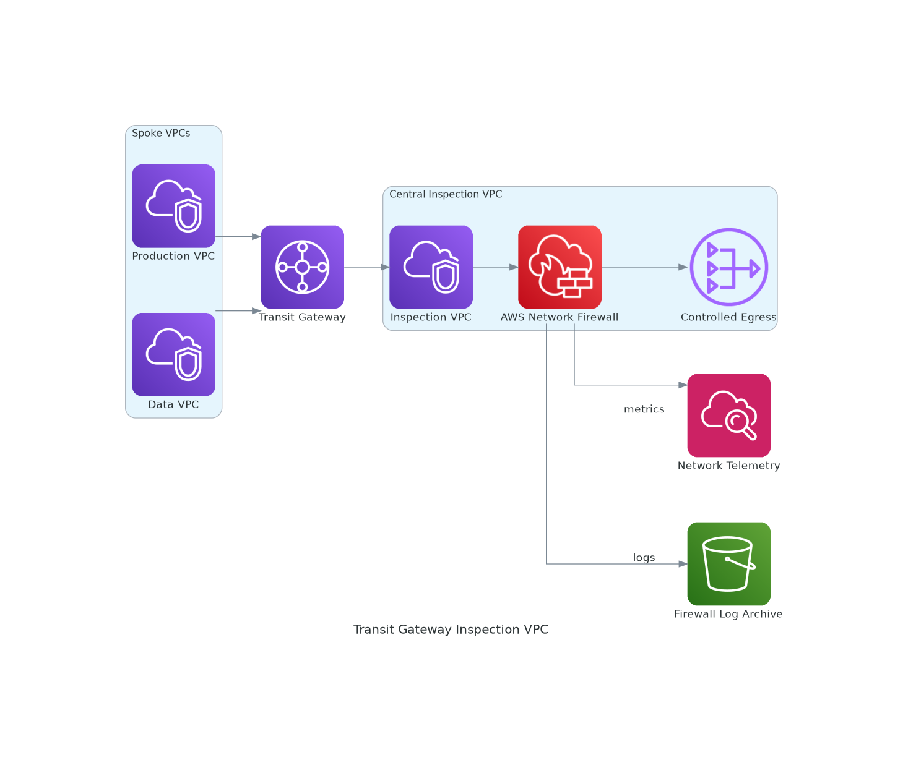

# AWS Architecture-as-Code Library

This root-level folder is the canonical source and rendered asset library for architecture patterns discussed throughout the handbook.

## How GitHub Actions Builds and Publishes the Diagrams

### Source and command map

| Stage | Source or command | Result |
|---|---|---|
| Discovery | `AWS-Enterprise-Architecture-Handbook/**/diagrams/**/*.py` | Architecture source inventory |
| Root consolidation | `architecture-diagrams/sources/*.py` | Canonical editable definitions |
| Renderer | `python AWS-Enterprise-Architecture-Handbook/scripts/render_aws_diagrams.py` | Executes all definitions |
| Central publication | `architecture-diagrams/rendered/*.png` | Root diagram library |
| Compatibility publication | `docs/diagrams/rendered/*.png` | Existing gallery paths remain valid |
| Local publication | `<architecture-document-folder>/rendered/<name>.png` | Diagram beside the article/runbook |
| Inventory | `architecture-diagrams/catalog.json` | Source-to-document-to-image traceability |

## Advanced Networking Hybrid Connectivity

[Editable source](sources/advanced-networking-hybrid-connectivity.py)

- [Architecture documentation](../docs/INDEX.md)
- [Architecture documentation](../docs/reference-architectures/advanced-networking-hybrid-connectivity.md)
- [Architecture documentation](../docs/runbooks/hybrid-networking-validation.md)

## Bedrock Multi Agent Operations

[Editable source](sources/bedrock-multi-agent-operations.py)

- [Architecture documentation](../docs/INDEX.md)
- [Architecture documentation](../docs/diagrams/README.md)
- [Architecture documentation](../docs/reference-architectures/bedrock-multi-agent-operations.md)
- [Architecture documentation](../docs/runbooks/bedrock-agent-safety-validation.md)

## Bedrock Rag Agent Security

[Editable source](sources/bedrock-rag-agent-security.py)

- [Architecture documentation](../docs/INDEX.md)
- [Architecture documentation](../docs/diagrams/README.md)
- [Architecture documentation](../docs/reference-architectures/bedrock-rag-agent-security.md)

## Developer Event Driven Platform

[Editable source](sources/developer-event-driven-platform.py)

- [Architecture documentation](../docs/INDEX.md)
- [Architecture documentation](../docs/reference-architectures/developer-event-driven-platform.md)
- [Architecture documentation](../docs/runbooks/event-driven-platform-validation.md)

## Edge Global Delivery

[Editable source](sources/edge-global-delivery.py)

- [Architecture documentation](../docs/INDEX.md)
- [Architecture documentation](../docs/reference-architectures/edge-global-delivery.md)
- [Architecture documentation](../docs/runbooks/edge-global-delivery-validation.md)

## Global Multi Region Active Active

[Editable source](sources/global-multi-region-active-active.py)

- [Architecture documentation](../docs/INDEX.md)
- [Architecture documentation](../docs/reference-architectures/global-multi-region-active-active.md)

## Honeypot Security Lake

[Editable source](sources/honeypot-security-lake.py)

- [Architecture documentation](../docs/INDEX.md)
- [Architecture documentation](../docs/reference-architectures/honeypot-security-lake.md)

## Hybrid Dns Private Connectivity

[Editable source](sources/hybrid-dns-private-connectivity.py)

- [Architecture documentation](../docs/INDEX.md)
- [Architecture documentation](../docs/reference-architectures/hybrid-dns-private-connectivity.md)
- [Architecture documentation](../docs/runbooks/hybrid-dns-private-connectivity-validation.md)

## Networking Private Service Access

[Editable source](sources/networking-private-service-access.py)

- [Architecture documentation](../docs/INDEX.md)
- [Architecture documentation](../docs/reference-architectures/networking-private-service-access.md)
- [Architecture documentation](../docs/runbooks/privatelink-service-validation.md)

## Sa Pro Disaster Recovery

[Editable source](sources/sa-pro-disaster-recovery.py)

- [Architecture documentation](../docs/INDEX.md)
- [Architecture documentation](../docs/reference-architectures/sa-pro-disaster-recovery.md)
- [Architecture documentation](../docs/runbooks/disaster-recovery-game-day.md)

## Sa Pro Multi Account Landing Zone

[Editable source](sources/sa-pro-multi-account-landing-zone.py)

- [Architecture documentation](../docs/INDEX.md)
- [Architecture documentation](../docs/reference-architectures/sa-pro-multi-account-landing-zone.md)
- [Architecture documentation](../docs/runbooks/multi-account-landing-zone-validation.md)

## Secure Multi Az Application

[Editable source](sources/secure-multi-az-application.py)

- [Architecture documentation](../docs/reference-architectures/secure-multi-az-application.md)

## Security Analytics Lakehouse

[Editable source](sources/security-analytics-lakehouse.py)

- [Architecture documentation](../docs/INDEX.md)
- [Architecture documentation](../docs/reference-architectures/security-analytics-lakehouse.md)
- [Architecture documentation](../docs/runbooks/security-analytics-pipeline-validation.md)

## Security Data Platform

[Editable source](sources/security-data-platform.py)

- [Architecture documentation](../docs/INDEX.md)
- [Architecture documentation](../docs/diagrams/README.md)

## Security Specialty Central Soc

[Editable source](sources/security-specialty-central-soc.py)

- [Architecture documentation](../docs/INDEX.md)
- [Architecture documentation](../docs/reference-architectures/security-specialty-central-soc.md)
- [Architecture documentation](../docs/runbooks/security-soc-validation.md)

## Security Zero Trust Identity

[Editable source](sources/security-zero-trust-identity.py)

- [Architecture documentation](../docs/INDEX.md)
- [Architecture documentation](../docs/diagrams/README.md)
- [Architecture documentation](../docs/reference-architectures/security-zero-trust-identity.md)
- [Architecture documentation](../docs/runbooks/zero-trust-identity-validation.md)

## Serverless Data Lake Analytics

[Editable source](sources/serverless-data-lake-analytics.py)

- [Architecture documentation](../docs/INDEX.md)
- [Architecture documentation](../docs/diagrams/README.md)
- [Architecture documentation](../docs/reference-architectures/serverless-data-lake-analytics.md)
- [Architecture documentation](../docs/runbooks/serverless-data-lake-validation.md)

## Transit Gateway Inspection Vpc

[Editable source](sources/transit-gateway-inspection-vpc.py)

- [Architecture documentation](../docs/INDEX.md)
- [Architecture documentation](../docs/diagrams/README.md)
- [Architecture documentation](../docs/reference-architectures/transit-gateway-inspection-vpc.md)
