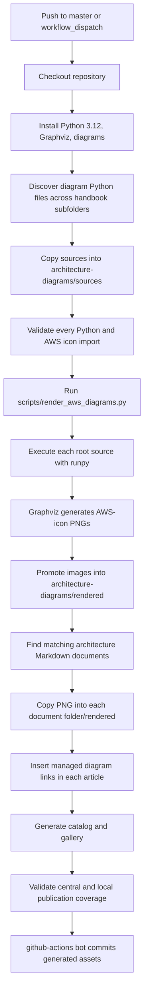
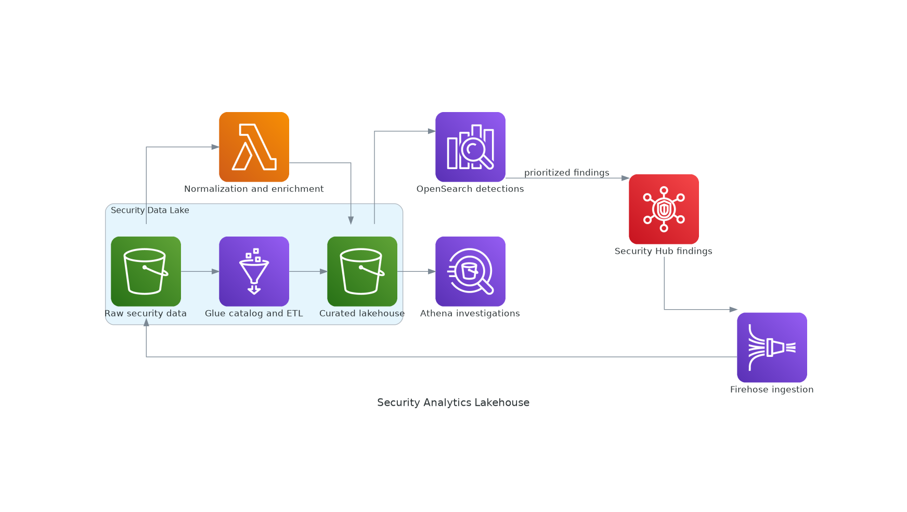
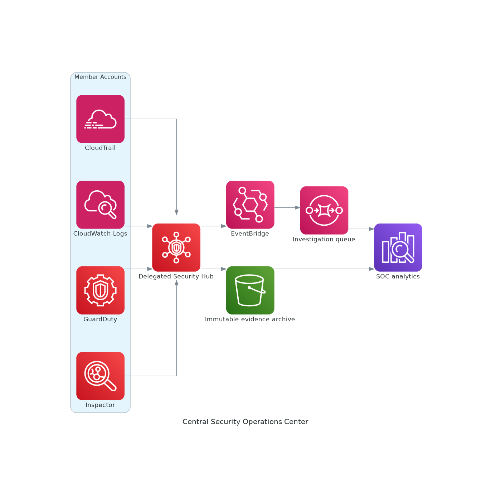

# AWS Architecture Diagram Gallery

The canonical root library is [AWS Architecture-as-Code Library](../../architecture-diagrams/README.md).

## How GitHub Actions Builds and Publishes the Diagrams

### Source and command map

| Stage | Source or command | Result |
|---|---|---|
| Discovery | `AWS-Enterprise-Architecture-Handbook/**/diagrams/**/*.py` | Architecture source inventory |
| Root consolidation | `architecture-diagrams/sources/*.py` | Canonical editable definitions |
| Renderer | `python AWS-Enterprise-Architecture-Handbook/scripts/render_aws_diagrams.py` | Executes all definitions |
| Central publication | `architecture-diagrams/rendered/*.png` | Root diagram library |
| Compatibility publication | `docs/diagrams/rendered/*.png` | Existing gallery paths remain valid |
| Local publication | `<architecture-document-folder>/rendered/<name>.png` | Diagram beside the article/runbook |
| Inventory | `architecture-diagrams/catalog.json` | Source-to-document-to-image traceability |

## Advanced Networking Hybrid Connectivity

[Root source](../../architecture-diagrams/sources/advanced-networking-hybrid-connectivity.py) · [Root rendered asset](../../architecture-diagrams/rendered/advanced-networking-hybrid-connectivity.png)

## Bedrock Multi Agent Operations

[Root source](../../architecture-diagrams/sources/bedrock-multi-agent-operations.py) · [Root rendered asset](../../architecture-diagrams/rendered/bedrock-multi-agent-operations.png)

## Bedrock Rag Agent Security

[Root source](../../architecture-diagrams/sources/bedrock-rag-agent-security.py) · [Root rendered asset](../../architecture-diagrams/rendered/bedrock-rag-agent-security.png)

## Developer Event Driven Platform

[Root source](../../architecture-diagrams/sources/developer-event-driven-platform.py) · [Root rendered asset](../../architecture-diagrams/rendered/developer-event-driven-platform.png)

## Edge Global Delivery

[Root source](../../architecture-diagrams/sources/edge-global-delivery.py) · [Root rendered asset](../../architecture-diagrams/rendered/edge-global-delivery.png)

## Global Multi Region Active Active

[Root source](../../architecture-diagrams/sources/global-multi-region-active-active.py) · [Root rendered asset](../../architecture-diagrams/rendered/global-multi-region-active-active.png)

## Honeypot Security Lake

[Root source](../../architecture-diagrams/sources/honeypot-security-lake.py) · [Root rendered asset](../../architecture-diagrams/rendered/honeypot-security-lake.png)

## Hybrid Dns Private Connectivity

[Root source](../../architecture-diagrams/sources/hybrid-dns-private-connectivity.py) · [Root rendered asset](../../architecture-diagrams/rendered/hybrid-dns-private-connectivity.png)

## Networking Private Service Access

[Root source](../../architecture-diagrams/sources/networking-private-service-access.py) · [Root rendered asset](../../architecture-diagrams/rendered/networking-private-service-access.png)

## Sa Pro Disaster Recovery

[Root source](../../architecture-diagrams/sources/sa-pro-disaster-recovery.py) · [Root rendered asset](../../architecture-diagrams/rendered/sa-pro-disaster-recovery.png)

## Sa Pro Multi Account Landing Zone

[Root source](../../architecture-diagrams/sources/sa-pro-multi-account-landing-zone.py) · [Root rendered asset](../../architecture-diagrams/rendered/sa-pro-multi-account-landing-zone.png)

## Secure Multi Az Application

[Root source](../../architecture-diagrams/sources/secure-multi-az-application.py) · [Root rendered asset](../../architecture-diagrams/rendered/secure-multi-az-application.png)

## Security Analytics Lakehouse

[Root source](../../architecture-diagrams/sources/security-analytics-lakehouse.py) · [Root rendered asset](../../architecture-diagrams/rendered/security-analytics-lakehouse.png)

## Security Data Platform

[Root source](../../architecture-diagrams/sources/security-data-platform.py) · [Root rendered asset](../../architecture-diagrams/rendered/security-data-platform.png)

## Security Specialty Central Soc

[Root source](../../architecture-diagrams/sources/security-specialty-central-soc.py) · [Root rendered asset](../../architecture-diagrams/rendered/security-specialty-central-soc.png)

## Security Zero Trust Identity

[Root source](../../architecture-diagrams/sources/security-zero-trust-identity.py) · [Root rendered asset](../../architecture-diagrams/rendered/security-zero-trust-identity.png)

## Serverless Data Lake Analytics

[Root source](../../architecture-diagrams/sources/serverless-data-lake-analytics.py) · [Root rendered asset](../../architecture-diagrams/rendered/serverless-data-lake-analytics.png)

## Transit Gateway Inspection Vpc

[Root source](../../architecture-diagrams/sources/transit-gateway-inspection-vpc.py) · [Root rendered asset](../../architecture-diagrams/rendered/transit-gateway-inspection-vpc.png)
