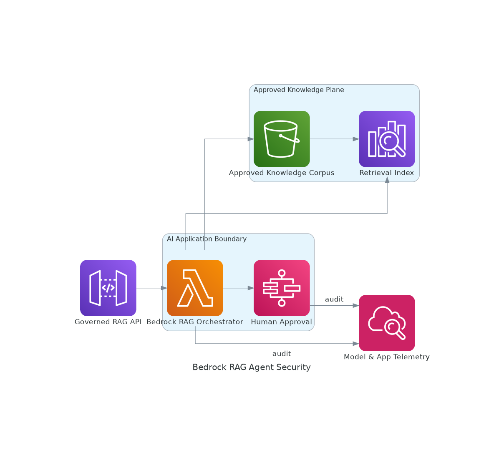

# Secure Bedrock RAG and Tool-Using Agent

<!-- GENERATED_ARCHITECTURE_DIAGRAM:START -->

## Rendered Architecture Diagram

[Central rendered asset](../../architecture-diagrams/rendered/bedrock-rag-agent-security.png) · [Editable Python source](../../architecture-diagrams/sources/bedrock-rag-agent-security.py)

<!-- GENERATED_ARCHITECTURE_DIAGRAM:END -->

## Case Study

A security operations organization needs an AI assistant that summarizes approved findings, retrieves internal procedures, opens tickets, and requests approval before any containment action.

## Business Objective

- reduce alert-triage time
- improve consistency of investigation notes
- preserve source provenance
- prevent unauthorized tool execution
- avoid exposing sensitive data to unapproved models or regions

## Technical Approach

Cognito authenticates users, API Gateway exposes a governed API, and a Lambda orchestration layer validates input and authorization. Amazon Bedrock supplies model inference and Guardrails. An approved S3 corpus is indexed in OpenSearch for retrieval. Step Functions manages human approval for consequential tool actions. KMS and CloudWatch provide encryption and auditability.

## Configuration Steps

1. Select approved Bedrock models and regions.
2. Create KMS keys and encrypted S3 knowledge buckets.
3. Create an OpenSearch vector index in private subnets.
4. Build an ingestion job that chunks, classifies, and indexes approved content.
5. Create Cognito user pools or federated authentication.
6. Create API Gateway and a least-privilege orchestration Lambda.
7. Configure Bedrock Guardrails and model invocation logging.
8. Define an MCP-style tool gateway with allowlisted schemas.
9. Use Step Functions for ticketing and containment approvals.
10. Add CloudWatch dashboards for latency, token usage, retrieval quality, refusals, and tool errors.

## Validation

- test retrieval authorization boundaries
- inject malicious instructions into documents and verify they are ignored
- verify citations map to authorized source documents
- verify containment cannot execute without approval
- confirm prompts and outputs follow retention policy

## Security and Privacy

Minimize data before invocation, use tenant-aware retrieval filters, log tool calls, redact secrets, disable unrestricted outbound tools, and prohibit use of private content for training without explicit approval.
