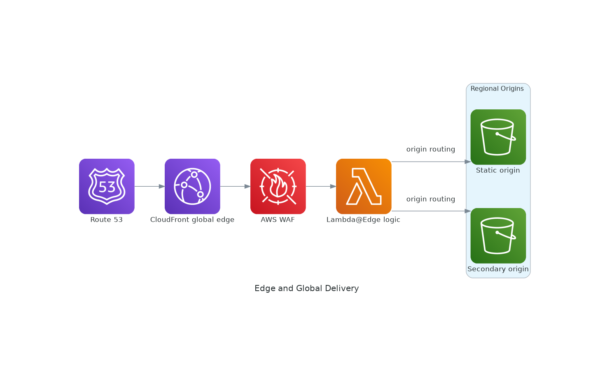

# Edge and Global Delivery Reference Architecture

<!-- GENERATED_ARCHITECTURE_DIAGRAM:START -->

## Rendered Architecture Diagram

[Central rendered asset](../../architecture-diagrams/rendered/edge-global-delivery.png) · [Editable Python source](../../architecture-diagrams/sources/edge-global-delivery.py)

<!-- GENERATED_ARCHITECTURE_DIAGRAM:END -->

Architecture source: `../diagrams/aws-icon/edge-global-delivery.puml`

## Case Study
A global digital commerce platform must deliver static and dynamic content with low latency, withstand volumetric attacks, and fail over between AWS Regions without exposing application workloads directly to the internet.

## Business Objective
- Reduce page and API latency for geographically distributed users.
- Protect public endpoints against common web exploits and DDoS events.
- Continue service during a regional application failure.
- Keep application compute in private subnets.

## Technical Approach
Route 53 provides DNS and health-based routing. CloudFront accelerates cacheable content and fronts protected origins. AWS WAF applies application-layer filtering, while Shield provides DDoS protections. Global Accelerator provides anycast entry for latency-sensitive TCP/UDP or multi-region application endpoints. Regional ALBs distribute traffic to private EKS workloads across multiple Availability Zones.

## Network Layout
- Region A VPC: `10.10.0.0/16`.
- Region B VPC: `10.20.0.0/16`.
- Public subnets: ALB only.
- Private application subnets: EKS worker nodes and services.
- No public IPs on application pods or nodes unless explicitly required.

## Configuration Steps
1. Create two non-overlapping regional VPCs.
2. Create public and private subnets across at least two AZs per Region.
3. Attach an Internet Gateway to each VPC.
4. Deploy regional ALBs in public subnets.
5. Deploy EKS or another application platform in private subnets.
6. Restrict application security groups to accept traffic only from the ALB security group.
7. Configure CloudFront distributions for static and dynamic origins where appropriate.
8. Attach AWS WAF web ACLs to CloudFront and/or regional ALBs.
9. Enable Shield Advanced where organizational risk and cost justify it.
10. Configure Route 53 health checks and routing policies.
11. Configure Global Accelerator with regional endpoint groups when low-latency multi-region application routing is required.
12. Store static assets in S3 with public access blocked and use controlled origin access.
13. Send ALB, WAF, CloudFront, Route 53, and application telemetry to centralized logging.
14. Create CloudWatch alarms for unhealthy targets, elevated 5xx responses, latency, and regional endpoint health.

## Security and Privacy
- Use TLS end to end where supported.
- Keep private workloads non-public.
- Minimize sensitive data in edge logs.
- Apply retention policies to access logs.
- Use WAF rate-based rules and managed protections as a baseline, then tune to application traffic.

## Scalability and Performance
CloudFront absorbs cacheable traffic at the edge. ALB and EKS scale horizontally. Route 53 and Global Accelerator provide independent routing options for DNS-based and network-edge multi-region patterns.

## Validation
- Confirm private application instances have no direct public exposure.
- Verify WAF blocks a controlled test rule.
- Simulate an unhealthy Region and verify traffic shifts as designed.
- Validate CloudFront cache behavior and origin protection.
- Confirm CloudWatch alarms fire on synthetic unhealthy-target conditions.

## Failure Modes
- CloudFront origin failure.
- Regional ALB or workload failure.
- DNS health-check misconfiguration.
- WAF false positives.
- Asymmetric multi-region data state.

## Well-Architected Review
Balance latency, availability, data consistency, and operational complexity. Multi-region application routing should be paired with a clearly defined data replication and recovery model.
