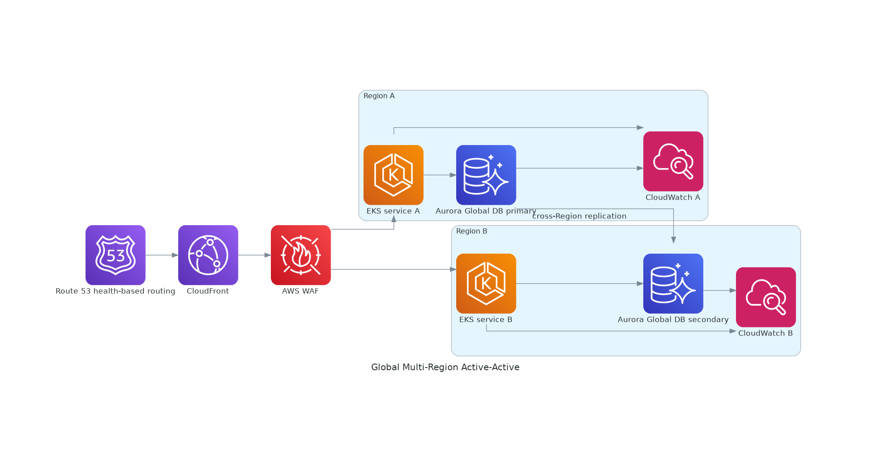

# Global Multi-Region Active-Active Application

<!-- GENERATED_ARCHITECTURE_DIAGRAM:START -->

## Rendered Architecture Diagram



[Central rendered asset](../../architecture-diagrams/rendered/global-multi-region-active-active.png) · [Editable Python source](../../architecture-diagrams/sources/global-multi-region-active-active.py)

<!-- GENERATED_ARCHITECTURE_DIAGRAM:END -->


## Case Study

A global digital-commerce organization requires low-latency access, regional fault isolation, and continued operation during a regional outage.

## Business Objective

- maintain customer access during regional failure
- reduce latency for global users
- scale independently by region
- protect regulated and personal data
- support controlled failover and rollback

## Technical Approach

Route 53 and CloudFront direct users to healthy regional application stacks. AWS WAF protects the public edge. Each Region contains an independently scalable EKS application tier and regional data services. Aurora Global Database supports relational replication, DynamoDB Global Tables support globally distributed key-value access, and S3 replication protects object data.

## Configuration Steps

1. Create separate regional VPCs with non-overlapping CIDRs.
2. Create public ingress, private application, and isolated data subnets across at least two AZs per Region.
3. Deploy EKS or ECS services with regional ALBs.
4. Configure AWS WAF and CloudFront.
5. Create Route 53 latency or geoproximity records with health checks.
6. Configure Aurora Global Database and test promotion.
7. Configure DynamoDB Global Tables where multi-writer behavior is required.
8. Configure S3 Cross-Region Replication and KMS keys.
9. Centralize CloudWatch, CloudTrail, Config, and security findings.
10. Run regional-failure game days and measure RTO/RPO.

## Validation

```bash
aws route53 list-health-checks
aws rds describe-global-clusters
aws dynamodb describe-table --table-name <table>
aws s3api get-bucket-replication --bucket <bucket>
```

## Security and Privacy

Use regional data-classification rules, least-privilege IAM, encryption in transit and at rest, private database access, explicit cross-region replication approval, and retention controls.

## Well-Architected Review

The design improves reliability and performance but adds replication cost, operational complexity, and consistency tradeoffs. Active-active should be justified by business recovery targets.
