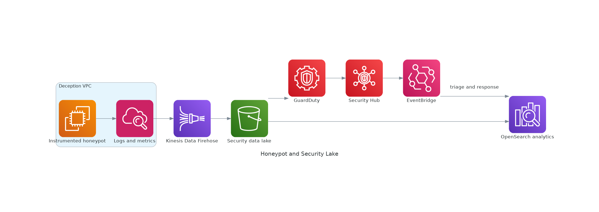

# Isolated Honeypot and Security Lake Detection Platform

<!-- GENERATED_ARCHITECTURE_DIAGRAM:START -->

## Rendered Architecture Diagram



[Central rendered asset](../../architecture-diagrams/rendered/honeypot-security-lake.png) · [Editable Python source](../../architecture-diagrams/sources/honeypot-security-lake.py)

<!-- GENERATED_ARCHITECTURE_DIAGRAM:END -->


## Case Study

A security team wants to observe commodity and targeted attack behavior without creating a path into production networks.

## Business Objective

- capture realistic hostile behavior safely
- enrich detection engineering and threat hunting
- produce reusable indicators and analytics
- prevent pivoting into production
- retain defensible audit evidence

## Technical Approach

The honeypot runs in a dedicated account and isolated VPC. There are no routes to production networks. CloudFront and WAF optionally expose controlled deception services. Host logs, CloudTrail, and VPC Flow Logs stream through Kinesis into Amazon Security Lake and OpenSearch. Security Hub and Detective support investigation.

## Configuration Steps

1. Create a dedicated deception account in AWS Organizations.
2. Apply SCPs that deny peering, Transit Gateway attachments, and access to production resources.
3. Create a VPC with only the routes required for the deception service and telemetry export.
4. Deploy hardened disposable honeypot instances or containers.
5. Enable CloudTrail, VPC Flow Logs, host logging, and time synchronization.
6. Configure Kinesis or Firehose delivery to Security Lake/S3.
7. Create OpenSearch indexes and analyst dashboards.
8. Add threat-intelligence enrichment and Security Hub findings.
9. Create rebuild automation so compromised workloads are replaced rather than trusted.
10. Review legal, privacy, and retention requirements.

## Validation

```bash
aws organizations list-policies --filter SERVICE_CONTROL_POLICY
aws ec2 describe-route-tables
aws ec2 describe-flow-logs
aws securitylake list-data-lakes
aws securityhub get-findings --max-results 10
```

## Security and Privacy

Never store real credentials or customer data in the honeypot. Avoid collecting unnecessary personal information. Segregate analyst access and document retention and disclosure requirements.
