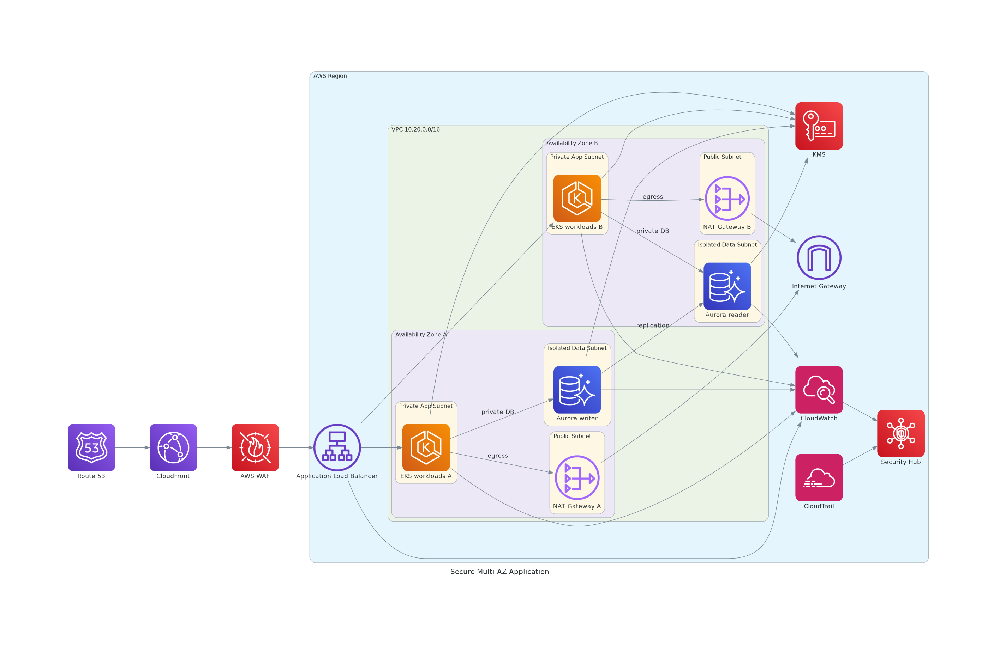

# Secure Multi-AZ Application Reference Architecture

<!-- GENERATED_ARCHITECTURE_DIAGRAM:START -->

## Rendered Architecture Diagram



[Central rendered asset](../../architecture-diagrams/rendered/secure-multi-az-application.png) · [Editable Python source](../../architecture-diagrams/sources/secure-multi-az-application.py)

<!-- GENERATED_ARCHITECTURE_DIAGRAM:END -->


## Case Study

A regulated digital-services organization needs a customer-facing application that remains available during an Availability Zone failure, protects sensitive records, supports predictable scaling, and produces centralized security evidence. The workload runs on Amazon EKS, uses Aurora or Amazon RDS for transactional data, and exposes only the load-balancing tier to the internet.

## Business Objective

- provide a responsive customer experience
- support seasonal and event-driven demand
- protect regulated and personal data
- minimize the blast radius of workload compromise
- recover from infrastructure failure without manual reconstruction
- provide auditable logs for security, privacy, and operational review

## Functional Requirements

1. Public DNS and edge delivery.
2. Layer 7 filtering and rate limiting.
3. Highly available application routing.
4. Container workloads distributed across two AZs.
5. Private database connectivity.
6. Controlled outbound connectivity.
7. Central metrics, logs, and API audit trails.

## Nonfunctional Requirements

| Area | Target |
|---|---|
| Availability | 99.99% application objective |
| Scaling | horizontal pod and cluster scaling |
| Latency | edge caching and regional application processing |
| Recovery | automated workload replacement; tested database recovery |
| Security | least privilege, private workloads, inspected egress |
| Privacy | encryption, minimization, retention controls, regional placement |
| Auditability | centralized and immutable security evidence |

## Technical Approach

Traffic resolves through Route 53 and enters CloudFront. AWS WAF enforces managed and application-specific rules. The Application Load Balancer spans public subnets in two Availability Zones. EKS worker capacity and application Pods run in private application subnets. Aurora/RDS runs in isolated data subnets with no direct internet route. Outbound traffic is inspected before leaving through a NAT Gateway in the same AZ.

The AWS-icon diagram is stored at:

```text
docs/diagrams/aws-icon/secure-vpc-reference.puml
```

## Configuration Steps

### 1. Establish account and Region controls

- select an approved Region based on service availability and data-residency requirements
- enable CloudTrail organization trails where applicable
- enable AWS Config and Security Hub
- apply service control policies and tag standards

### 2. Create the VPC

```bash
aws ec2 create-vpc \
  --cidr-block 10.20.0.0/16 \
  --tag-specifications 'ResourceType=vpc,Tags=[{Key=Name,Value=secure-app-vpc}]'
```

Enable DNS support and DNS hostnames.

### 3. Create six subnets

| AZ | Subnet | CIDR | Purpose |
|---|---|---|---|
| AZ-a | Public | `10.20.0.0/24` | ALB and NAT Gateway |
| AZ-b | Public | `10.20.1.0/24` | ALB and NAT Gateway |
| AZ-a | Private app | `10.20.10.0/24` | EKS nodes and Pods |
| AZ-b | Private app | `10.20.11.0/24` | EKS nodes and Pods |
| AZ-a | Isolated data | `10.20.20.0/24` | database resources |
| AZ-b | Isolated data | `10.20.21.0/24` | database resources |

### 4. Configure internet and NAT routing

- attach one Internet Gateway to the VPC
- route public subnet `0.0.0.0/0` traffic to the Internet Gateway
- deploy one NAT Gateway per AZ
- route each private application subnet through its local-AZ NAT path
- keep data subnets without an internet default route

### 5. Configure NACLs and security groups

Use NACLs for coarse subnet guardrails and security groups for stateful workload policy.

- ALB security group: allow HTTPS from approved public sources
- EKS workload security group: allow application traffic only from the ALB security group
- database security group: allow the database port only from the application security group
- restrict egress to required destinations and ports

### 6. Add private AWS service access

Create VPC endpoints for services such as S3, ECR, CloudWatch, Systems Manager, Secrets Manager, and STS where supported. This reduces NAT dependency and exposure.

### 7. Deploy EKS across both AZs

- create the EKS control plane
- create managed node groups in both private application subnets
- apply Pod disruption budgets and topology-spread constraints
- configure horizontal Pod autoscaling
- use IRSA or EKS Pod Identity for workload permissions

### 8. Deploy the database

- use a multi-AZ Aurora or RDS deployment
- encrypt storage and snapshots with KMS
- enable automated backups and deletion protection
- store credentials in Secrets Manager
- use RDS Proxy when connection scaling requires it

### 9. Configure edge and ingress protection

- create an ALB and target groups
- enforce TLS with ACM certificates
- connect CloudFront to the ALB origin
- associate AWS WAF with CloudFront or ALB
- configure rate limits, managed rules, bot controls, and application-specific exclusions

### 10. Configure egress inspection

Route required egress through AWS Network Firewall or a centralized inspection architecture. Log allowed and denied traffic. Validate route symmetry before production use.

### 11. Enable monitoring and logging

- CloudWatch Container Insights or managed Prometheus
- ALB access logs
- CloudFront and WAF logs
- VPC Flow Logs
- EKS control-plane audit logs
- database performance and audit logs
- CloudTrail and AWS Config

### 12. Test resilience

- terminate a worker node
- drain an AZ-specific node group in a test environment
- validate load balancing across remaining replicas
- test database failover
- restore a backup into an isolated environment

## Security and Privacy Controls

- encrypt traffic with TLS and data with KMS
- use short-lived credentials and workload identities
- prevent direct public access to application and data tiers
- minimize logs containing PII and apply retention policies
- restrict production access through approved administrative paths
- aggregate findings in Security Hub and investigate with Detective

## Performance and Scalability

CloudFront reduces origin load. ALB distributes requests across healthy targets. EKS scales Pods and compute independently. Aurora readers, RDS Proxy, caching, and asynchronous processing can be added when workload measurements justify them.

## Validation Checklist

```bash
aws ec2 describe-route-tables
aws ec2 describe-network-acls
aws ec2 describe-security-groups
aws eks describe-cluster --name <cluster>
kubectl get nodes -L topology.kubernetes.io/zone
kubectl get pods -A -o wide
aws rds describe-db-clusters
```

Confirm that application and database resources do not have unintended public addresses or public routes.

## Well-Architected Review

- **Operational Excellence:** infrastructure as code, deployment automation, runbooks
- **Security:** least privilege, encryption, detection, inspected egress
- **Reliability:** multi-AZ placement, backups, tested failover
- **Performance:** edge caching, autoscaling, managed database capabilities
- **Cost:** endpoint use, scaling limits, log lifecycle, storage classes
- **Sustainability:** managed services and measured resource utilization
