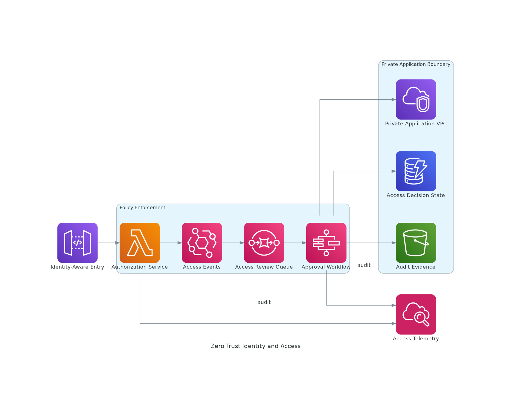

# Zero Trust Identity and Private Application Access

<!-- GENERATED_ARCHITECTURE_DIAGRAM:START -->

## Rendered Architecture Diagram

[Central rendered asset](../../architecture-diagrams/rendered/security-zero-trust-identity.png) · [Editable Python source](../../architecture-diagrams/sources/security-zero-trust-identity.py)

<!-- GENERATED_ARCHITECTURE_DIAGRAM:END -->

Architecture: `../diagrams/aws-icon/security-zero-trust-identity.puml`

## Case Study
A financial-services organization is replacing broad VPN access with application-specific access based on user identity, device posture, workload identity, and explicit authorization.

## Business Objective
Reduce implicit trust, remove standing credentials, minimize lateral movement, and create auditable access decisions for workforce and application identities.

## Technical Approach
Use IAM Identity Center for workforce federation, Verified Access for identity-aware application access, IAM roles for workload identity, Verified Permissions for fine-grained authorization, PrivateLink for private service consumption, Secrets Manager for secret lifecycle, KMS for encryption, and CloudTrail for access evidence.

## Configuration Steps
1. Integrate the enterprise identity provider with IAM Identity Center.
2. Create permission sets aligned to job functions and assign them to groups, not individual users where possible.
3. Configure Verified Access trust providers and application endpoints.
4. Define access policies using identity and device context.
5. Replace embedded cloud credentials with IAM roles and workload identity.
6. Define fine-grained application authorization policies in Verified Permissions where appropriate.
7. Publish internal services through PrivateLink or private load balancers instead of broad network reachability.
8. Store secrets in Secrets Manager and enable rotation for supported credentials.
9. Encrypt secrets and sensitive application data with customer-managed KMS keys when governance requires it.
10. Enable CloudTrail data and management events required for investigation.

## Validation
- Attempt access from an unauthorized identity and verify denial.
- Validate that application services are not internet-addressable.
- Confirm short-lived sessions and role assumption events are logged.
- Verify secrets can be rotated without application code changes.
- Review authorization policy decisions for least privilege.

## Security and Privacy
Avoid using identity telemetry for unrelated employee surveillance. Retain access logs according to legal and security requirements, minimize unnecessary attributes, and protect device posture and identity data as sensitive telemetry.
