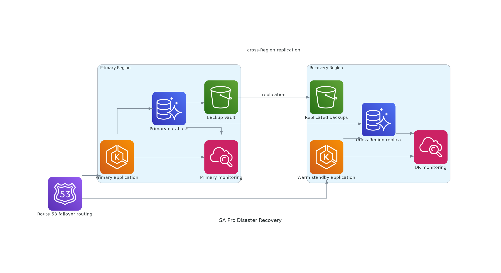

# Multi-Region Disaster Recovery Game Day

<!-- GENERATED_ARCHITECTURE_DIAGRAM:START -->

## Rendered Architecture Diagram

[Central rendered asset](../../architecture-diagrams/rendered/sa-pro-disaster-recovery.png) · [Editable Python source](../../architecture-diagrams/sources/sa-pro-disaster-recovery.py)

<!-- GENERATED_ARCHITECTURE_DIAGRAM:END -->

Visual architecture: `../diagrams/aws-icon/sa-pro-disaster-recovery.puml`

## Objective
Measure whether the application can meet documented RTO and RPO targets during a controlled regional-failure simulation.

## Preparation
- Confirm test scope and business approval.
- Verify backups and replication health.
- Freeze unrelated production changes.
- Confirm recovery-region capacity quotas.
- Identify rollback and failback owners.

## Exercise
1. Record starting timestamps and replication lag.
2. Simulate primary application unavailability in a non-production or approved test environment.
3. Confirm monitoring detects the failure.
4. Promote the recovery database where required.
5. Scale the recovery application tier.
6. Shift test traffic using Route 53 or the approved routing mechanism.
7. Run functional, security, and data-integrity checks.
8. Record achieved RTO and observed data-loss window.
9. Restore the primary environment.
10. Reconcile data before controlled failback.

## Evidence
Capture CloudWatch alarms, Route 53 state, database replication state, deployment capacity, synthetic-test results, timestamps, and operator decisions.

## Exit Criteria
The measured recovery meets or documents gaps against target RTO/RPO, failover does not weaken security controls, and corrective actions have named owners and due dates.
