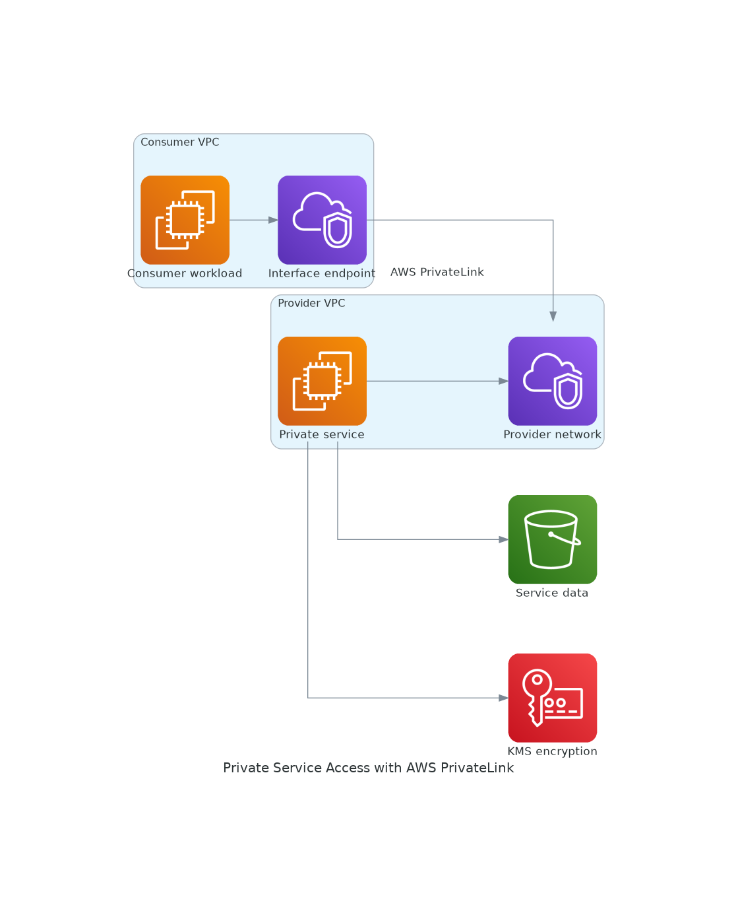

# PrivateLink Service Validation Runbook

<!-- GENERATED_ARCHITECTURE_DIAGRAM:START -->

## Rendered Architecture Diagram



[Central rendered asset](../../architecture-diagrams/rendered/networking-private-service-access.png) · [Editable Python source](../../architecture-diagrams/sources/networking-private-service-access.py)

<!-- GENERATED_ARCHITECTURE_DIAGRAM:END -->


Visual architecture: `../diagrams/aws-icon/networking-private-service-access.puml`

## Provider Checks
```bash
aws elbv2 describe-load-balancers
aws ec2 describe-vpc-endpoint-service-configurations
```
Confirm the provider NLB is healthy and endpoint service permissions are restricted.

## Consumer Checks
```bash
aws ec2 describe-vpc-endpoints
```
Confirm the interface endpoint is available in the intended private subnets with the expected security groups.

## Connectivity Test
From an authorized consumer workload:
```bash
nslookup <private-service-name>
curl -I https://<private-service-name>/health
```
Confirm DNS resolves to endpoint ENIs and the request succeeds without NAT or internet routing.

## Negative Tests
- Attempt access from an unauthorized VPC or account.
- Attempt direct provider address access.
- Remove the endpoint security-group rule and confirm denial.

## Exit Criteria
Service traffic stays on private AWS networking, consumer scope is explicit, and application authentication remains enforced.
